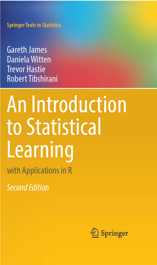

```{r, include = FALSE}
knitr::opts_chunk$set(
  collapse = TRUE,
  comment = "#>",
  
  out.width='100%',
  fig.align = "center",
  fig.width = 7,
  fig.height = 5,
  
  message = FALSE,
  warning = FALSE
)
```


## learning outcomes

- A forecasting workflow using `tidymodels`, `modeltime` and `parsnip`.
- An introduction to exponential smoothing
- An introduction to the boosting concept in machine learning 
- An example using comparing
  - ARIMA
  - ARIMA boosted
  - Exponential Smoothing
  - Linear Regression
  - MARS (Multivariate Adaptive Regression Splines)

## Workflow

Here's the general process and where the functions fit. 

```{r, echo=F,  out.width="100%", fig.align='center', fig.cap="The Modeltime Workflow"}
knitr::include_graphics("modeltime_workflow.jpg")
```

Just follow the `modeltime` workflow, which is detailed in 6 convenient steps:

1. Collect data and split into training and test sets
2. Create & Fit Multiple Models
3. Add fitted models to a __Model Table__
4. __Calibrate__ the models to a testing set.
5. Perform Testing Set _Forecast_ & _Accuracy_ Evaluation
6. __Refit__ the models to Full Dataset & _Forecast_ Forward


## Financial Time Series Forecasting Example


```{r}
library(xgboost)
library(tidymodels)
library(modeltime)
library(tidyverse)
library(lubridate)
library(timetk)

# This toggles plots from plotly (interactive) to ggplot (static)
interactive <- TRUE
```

### Step 1 - Collect data and split into training and test sets. 

```{r}
# Data
tidyquant::tq_get("^VIX",from="2020-01-01") %>% 
  select(date,adjusted) %>% 
  rename(value=adjusted)->vix

```

> One poor quality feature of yahoo finance API data is that you can have potentially overlapping dates.  This will create bias in any time series models so needs to be consider at this pre-processing stage.

Do we have duplicate dates?

```{r}
vix[duplicated(vix$date,fromLast = T),]$date->duplicated_date
vix %>% filter(date==duplicated_date)

vix<-vix %>% distinct(date,.keep_all = TRUE)
```


We can visualize the dataset. 

```{r}
vix %>%
  plot_time_series(date, value, .interactive = interactive)
```


Let's split the data into training and test sets using `initial_time_split()`

```{r}
# Split Data 80/20
splits <- initial_time_split(vix, prop = 0.8)
```


### Step 2 - Create & Fit Multiple Models

We can easily create dozens of forecasting models by combining `modeltime` and `parsnip`. We can also use the `workflows` interface for adding preprocessing! Your forecasting possibilities are endless. Let's get a few basic models developed:

>Boosting, is one of many approach for improving the predictions from a prediction model. Like bagging, boosting is a general approach that can be applied to many statistical learning methods including time series models.  Bagging involves creating multiple copies of the original training data set using the bootstrap, fitting a similar model to each copy, and then combining all of the model estimates in order to create a single predictive model. Notably, each model is built on a bootstrap data set, independent of the other models. Boosting works in a similar way, except that the models are grown sequentially: each model is grown using information from previously estimated models. Boosting does not involve bootstrap sampling; instead each tree is fit on a modified version of the original data set.  In the following example we will simply use boosting to see if we can improve on ARIMA model errors (residuals).  Boosting can also be applied to the predictors in the model

See section 8.3 in below.  Download an second edition copy [here](https://hastie.su.domains/ISLR2/ISLRv2_website.pdf)


- ARIMA
- ARIMA boosted
- Exponential Smoothing
- Linear Regression
- MARS (Multivariate Adaptive Regression Splines) a *non-linear generalised additive model*


__Important note: Handling Date Features__

_Modeltime models_ (e.g. `arima_reg()`) are created with a date or date time feature in the model. You will see that most models include a formula like `fit(value ~ date, data)`. 

_Parsnip models_ (e.g. `linear_reg()`) typically should not have date features, but may contain derivatives of dates (e.g. month, year, etc). You will often see formulas like `fit(value ~ as.numeric(date) + month(date), data)`.

#### Model 1: Auto ARIMA (Modeltime)

First, we create a basic univariate ARIMA model using "Auto Arima" using `arima_reg()`

```{r, message=TRUE}
# Model 1: auto_arima ----
model_fit_arima_no_boost <- arima_reg() %>%
    set_engine(engine = "auto_arima") %>%
    fit(value ~ date, data = training(splits))
```

#### Model 2: Boosted Auto ARIMA (Modeltime)

Next, we create a boosted ARIMA using `arima_boost()`. Boosting uses XGBoost to model the ARIMA errors. Note that model formula contains both a date feature and derivatives of date
 - ARIMA uses the date
 - XGBoost uses the derivatives of date as regressors
 
Normally I'd use a preprocessing workflow for the month features using a function like `step_timeseries_signature()` from `timetk` to help reduce the complexity of the parsnip formula interface. 

```{r, message=TRUE}
# Model 2: arima_boost ----
model_fit_arima_boosted <- arima_boost(
    min_n = 2,
    learn_rate = 0.015
) %>%
    set_engine(engine = "auto_arima_xgboost") %>%
    fit(value ~ date + as.numeric(date) + 
          factor(month(date, label = TRUE), ordered = F),
        data = training(splits))
```


#### Model 3: Exponential Smoothing (Modeltime)

Next, create an Error-Trend-Season (ETS) model using an Exponential Smoothing State Space model. This is accomplished with `exp_smoothing()`.

```{r, message=TRUE}
# Model 3: ets ----
model_fit_ets <- exp_smoothing() %>%
    set_engine(engine = "ets") %>%
    fit(value ~ date, data = training(splits))
```

#### Model 4: Prophet (Modeltime)

We'll create a `prophet` model using `prophet_reg()`.

```{r, message=TRUE}
# Model 4: prophet ----
model_fit_prophet <- prophet_reg() %>%
    set_engine(engine = "prophet") %>%
    fit(value ~ date, data = training(splits))
```

#### Model 5: Linear Regression (Parsnip)

We can model time series linear regression (TSLM) using the `linear_reg()` algorithm from `parsnip`. The following derivatives of date are used:

- _Trend:_ Modeled using `as.numeric(date)`
- _Seasonal:_ Modeled using `month(date)`

```{r, message=TRUE}
# Model 5: lm ----
model_fit_lm <- linear_reg() %>%
    set_engine("lm") %>%
    fit(value ~ as.numeric(date) + 
          factor(month(date, label = TRUE), ordered = FALSE),
        data = training(splits))
```

#### Model 6: MARS (Workflow)

We can model a Multivariate Adaptive Regression Spline model using `mars()`. I've modified the process to use a `workflow` to standardize the preprocessing of the features that are provided to the machine learning model (mars). 

```{r, message=TRUE}
# Model 6: earth ----
model_spec_mars <- mars(mode = "regression") %>%
    set_engine("earth") 

recipe_spec <- recipe(value ~ date, data = training(splits)) %>%
    step_date(date, features = "month", ordinal = FALSE) %>%
    step_mutate(date_num = as.numeric(date)) %>%
    step_normalize(date_num) %>%
    step_rm(date)
  
wflw_fit_mars <- workflow() %>%
    add_recipe(recipe_spec) %>%
    add_model(model_spec_mars) %>%
    fit(training(splits))
```

OK, with these 6 models, we'll show how easy it is to forecast. 

### Step 3 - Add fitted models to a Model Table. 

The next step is to add each of the models to a Modeltime Table using `modeltime_table()`. This step does some basic checking to make sure each of the models are fitted and that organizes into a scalable structure called a ___"Modeltime Table"___ that is used as part of our _forecasting workflow._

We have 6 models to add. A couple of notes before moving on:

- Note that some of the models have _tunable parameters_. 
- It's expected that tuning and parameter selection is performed prior to incorporating into a Modeltime Table. 
- If you try to add an unfitted model, the `modeltime_table()` will complain (throw an informative error) saying you need to `fit()` the model. 

```{r, paged.print = FALSE}
models_tbl <- modeltime_table(
    model_fit_arima_no_boost,
    model_fit_arima_boosted,
    model_fit_ets,
    model_fit_prophet,
    model_fit_lm,
    wflw_fit_mars
)

models_tbl
```

### Step 4 - Calibrate the model to a testing set. 

Calibrating adds a new column, `.calibration_data`, with the test predictions and residuals inside. A few notes on Calibration:

- Calibration is how confidence intervals and accuracy metrics are determined 
- ___Calibration Data___ is simply forecasting predictions and residuals that are calculated from out-of-sample data.
- After calibrating, the calibration data follows the data through the forecasting workflow. 

```{r, paged.print = FALSE}
calibration_tbl <- models_tbl %>%
    modeltime_calibrate(new_data = testing(splits))

calibration_tbl
```

### Step 5 - Testing Set Forecast & Accuracy Evaluation

There are 2 critical parts to an evaluation.

- Visualizing the Forecast vs Test Data Set
- Evaluating the Test (Out of Sample) Accuracy

#### 5A - Visualizing the Forecast Test

Visualizing the Test Error is easy to do using the __interactive plotly visualization (just toggle the visibility of the models using the Legend).__ 

```{r}
calibration_tbl %>%
    modeltime_forecast(
        new_data    = testing(splits),
        actual_data = vix
    ) %>%
    plot_modeltime_forecast(
      .legend_max_width = 25, # For mobile screens
      .interactive      = interactive
    )
```

>Describe the output 

#### 5B - Accuracy Metrics

We can use `modeltime_accuracy()` to collect common accuracy metrics. The default reports the following metrics using `yardstick` functions:

- __MAE__ - Mean absolute error, `mae()`
- __MAPE__ - Mean absolute percentage error, `mape()`
- __MASE__ - Mean absolute scaled error, `mase()`
- __SMAPE__ - Symmetric mean absolute percentage error, `smape()`
- __RMSE__ - Root mean squared error, `rmse()`
- __RSQ__ - R-squared, `rsq()`

These of course can be customized following the rules for creating new yardstick metrics, but the defaults are very useful. Refer to `default_forecast_accuracy_metrics()` to learn more.

To make table-creation a bit easier, I've included `table_modeltime_accuracy()` for outputing results in either interactive (`reactable`) or static (`gt`) tables. 

```{r}
calibration_tbl %>%
    modeltime_accuracy() %>%
    table_modeltime_accuracy(
        .interactive = interactive
    )
```

>Describe the output

### Step 6 - Refit to Full Dataset & Forecast Forward

The final step is to refit the models to the full dataset using `modeltime_refit()` and forecast them forward. 

```{r, paged.print = F, message=F}
refit_tbl <- calibration_tbl %>%
    modeltime_refit(data = vix)

refit_tbl %>%
    modeltime_forecast(h =252, actual_data = vix) %>%
    plot_modeltime_forecast(
      .legend_max_width = 25, # For mobile screens
      .interactive      = interactive
    )
```

> Refitting - What happened? 

